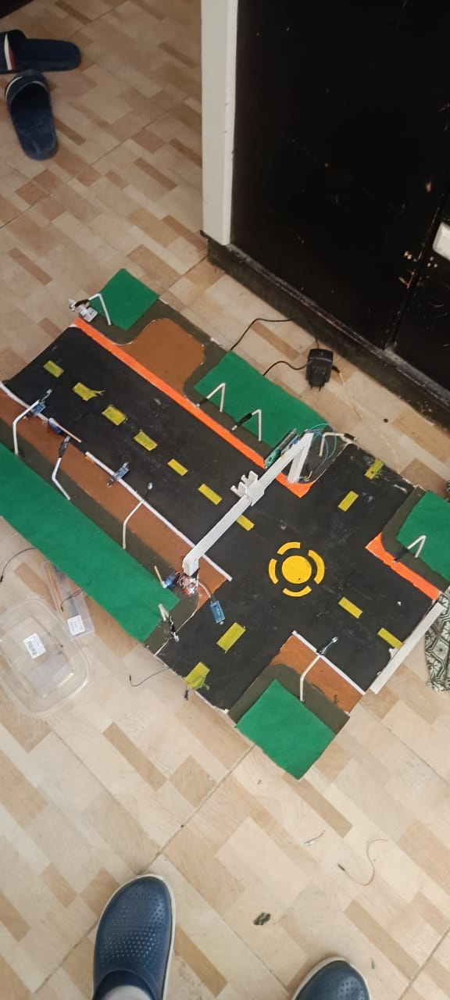
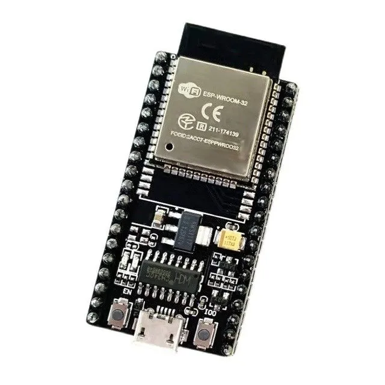

# Smart Road Eye: AI-Powered Traffic Management System

## Project Overview

**Smart Road Eye** is a traffic management system as I see a challenge that faces my country which is the conjestion and the bad traffic distribution and the bad traffic light function as sometimes you find the other road is very emepty and the second road is full but they must wait untill the traffic light count down that what make me want to made this project where it use AI vision through Raspberry Pi with camera module to detect cars and count them and detect emergency if there is one also another system to reduce the fast car speeds was added which is the ACTibump and another system for citzen which is the push button and the servo and there is a lane for emergency which is closed and open only if there is an emergency.

### Key Systems

- **Emergency detection and emergency lane**: Raspberry Pi with Camera Module detects an emergency car, it sends to the servo gate to open the emergency lane.
- **Speed ACTibump**: Two IRs that calculate the time interval, using it, we can calculate the velocity. If it exceeds the road limit speed, it opens an ACTibump using a servo to reduce the speed.
- **Light System**: A LDR sensor is used to detect whether day or night. Then, if it's daytime, the light of the road is always on, and if it's nighttime, the light turns on based on ultrasonic detection if a vehicle is present; then the road light turns on.
- **push button and servo gate for citizen lane**: it is a push button; when clicked, it alerts the system that there are people who want to pass and are waiting. Hence, it considers them to pass first if there is no emergency, and opens the servo gate; also, the gate is safer for children.

---
## images and how they will be connected to the prototype:
The project was first made as a small prototype for the original road, but for the Raspberry Pi, if it works, it can be used as it is on the actual road but if the governorate takes this idea, there will be high-quality cameras and high processing, so I made this as a start to make my country.
- First, the base is a cardboard that we colored and made look like a road, as shown in the image
<p align="center">
  
</p>
- Second, we printed some 3D parts for the project. We printed a stand for the traffic light and attached another stand to it that inserts into the first one for the camera module.
<p align="center">
  
  
  
</p>
- Thirdly, some carton caps were put under the prototype to make a space under it for connections to be from downward and to make the ACTibump move up and down using the servo.
<p align="center">
  
</p>

### Hardware Components

#### 1. AI Vision System (Raspberry Pi) 
- **Raspberry Pi 4** (8GB+ RAM) - Main AI processing unit
<p align="center">
  
</p>
- **Raspberry Pi Camera Module v2** - High-quality road monitoring camera
<p align="center">
  
</p>
- **MicroSD Card** (64GB+) - Operating system and software storage
<p align="center">
  
</p>
- **Raspberry Pi type-c power supply** - to operate the Raspberry Pi
<p align="center">
  
</p>
- Runs YOLO object detection model locally on the Raspberry Pi system for real-time traffic analysis and sets it up to send results to Firebase

#### 2. Traffic Control System (ESP32 Master) 
- **ESP32 Development Board** - Main traffic controller
<p align="center">
  
</p>
- **Traffic Light Module** - Physical 3-color LED traffic signal
<p align="center">
  
</p>
- **3x Servo Motors** - Emergency gate, speed bump, and Citizen gate control
<p align="center">
  
</p>
- **5V Relay Module** - Street light control (10 white LEDs)
<p align="center">
  
</p>
- **I2C LCD Display 16x2** - System status display
<p align="center">
  
</p>

#### 3. Sensor Network
- **MQ135 Gas Sensor** - Air pollution monitoring note: in the prototype, it is not necessary as there won't be actual pollution, so I removed it
- **2x IR Sensors** - use for Vehicle speed calculation by calculating the time and dividing the distance between the two IRs over the time gotten by the IRs, and use its speed result to choose whether to open or close the bumper.
<p align="center">
  
</p>
- **HC-SR04 Ultrasonic Sensor** - Vehicle presence detection to reduce energy by decreasing the time that light is on.
<p align="center">
  
</p>
- **LDR Module** - Day/night detection for automatic lighting
<p align="center">
  
</p>
- **Push Button** - Citizen crossing request
<p align="center">
  
</p>

#### 4. Communication
- **WiFi Connectivity** - Both Raspberry Pi and ESP32 connect to WiFi, and both connect to Firebase to share data fast and efficiently. Also, the app uses the database as the source of the data.

### Software Stack

- **Raspberry Pi**: Python 3 with YOLO (Ultralytics) (YOLO v11 nano), OpenCV, Picamera2, Pyrebase4
- **ESP32 Master**: Arduino C++ with Firebase ESP32, ESP32Servo, LiquidCrystal_I2C libraries
- **Cloud**: Firebase Realtime Database
- **Mobile App**: Flutter (Dart) with Firebase integration and connect it with Firebase

---

## How It Works

### 1. AI Vision Processing
```
Raspberry Pi Camera image captures -> YOLO Detection -> Object Classification -> Firebase Upload -> ESP32 master board to make the action
```
- Camera captures road images continuously
- YOLO model detects and classifies vehicles (Normal Car or Emergency), also it counts the number of cars detected, whether emergency or normal, which is the traffic density
- Detection results sent to Firebase every second

### 2. Traffic Control Logic
```
Firebase Data -> ESP32 Master -> Sensor Reading -> actions for each system
```
- ESP32 Master reads AI detection data from Firebase and uploads sensor readings for the app
- Controls physical traffic lights
- Displays status on I2C LCD directly connected to ESP32

### 3. Data Flow
```
Raspberry Pi -> Firebase -> ESP32 Master -> Traffic Lights -> I2C LCD Display
                    |                  
            Mobile App (Flutter)      
```

### 4. Sensor Integration
- **Air Pollution**: MQ135 sensor monitors air quality, data sent to Firebase using ESP32 master
- **Speed Detection**: Two IR sensors measure vehicle speed using the distance between the two IRs over the time measured by the IRs, triggering a speed bump to reduce the car's speed
- **Vehicle Detection**: Ultrasonic sensor detects vehicle presence to turn on the light if it is night to reduce the electric consumption
- **Day/Night**: LDR sensor automatically controls street lighting with the help of the ultrasonic

---

## Project Structure

```
Smart-Road/
├── code/
│   ├── ESP32_Master/
│   │   └── esp32_master.ino          # Main traffic controller code
│   ├── my_model/
│   │   ├── raspberry_pi_yolo_client.py  # AI detection client (Raspberry Pi)
│   │   ├── my_model.pt                # Trained YOLO model
│   │   ├── requirements.txt            # Python dependencies
│   │   └── README.md                  # Raspberry Pi detection guide
│   ├── Application Flutter/           # You can access the final APK through Smart-Road\Code\Application flutter\build\app\outputs\flutter-apk
│   │   ├── lib/
│   │   │   ├── main.dart              # Flutter app main file
│   │   │   ├── models/
│   │   │   │   └── road_data.dart     # Data models
│   │   │   └── services/
│   │   │       ├── background_monitor.dart      # Background monitoring
│   │   │       ├── notification_service.dart    # Push notifications
│   │   │       └── road_cache_manager.dart      # Data caching
│   │   ├── assets/
│   │   │   └── sounds/                # App sound files
│   │   ├── pubspec.yaml               # Flutter dependencies
│   │   └── README.md                  # Flutter app documentation
│   ├── Firebase/
│   │   ├── firebase_config.h.example  # Firebase configuration template
│   │   └── firebase_rules.json        # Database security rules
│   ├── Labels/
│   │   ├── Hassan/                    # Training images (Hassan folder)
│   │   └── [Training images]          # Additional training data
│   ├── WIRING_CONNECTIONS.md          # Complete wiring guide
│   └── RASPBERRY_PI_SETUP_GUIDE.md   # Beginner setup guide
├── AI/
│   ├── toy_car_detection/             # YOLO model training project
│   │   ├── train.py                   # Training script
│   │   ├── dataset/                   # Training dataset
│   │   └── [YOLO model files]          # Pre-trained models
│   ├── src/
│   │   ├── detector.py                # Detection script
│   │   └── api_detector.py            # API detection script
│   └── requirements.txt               # AI training dependencies
├── 3D/
│   ├── Printer/                       # 3D printable STL files
│   └── [3D model files]                # Component 3D models (STEP files)
├── Images/                             # Project images and screenshots
├── BOM.csv                             # Bill of Materials
├── README.md                           # This file (main documentation)
└── JOURNAL.md                          # Project development journal
```

---

## Installation & Setup

### Prerequisites

- Raspberry Pi 4 (8GB+ RAM recommended)
- ESP32 Development Board
- All sensors and components (see BOM.csv)
- WiFi network access
- Firebase account and project

### Step 1: Raspberry Pi Setup

1. **Install Raspberry Pi OS**
   - Download Raspberry Pi Imager
   - Flash OS to MicroSD card
   - Enable SSH and configure WiFi during setup
2. **Enable Camera**
3. **Install Dependencies**
4. **Install Python Packages**
5. **Configure and Run Detection**

**Detailed Setup**: See [code/RASPBERRY_PI_SETUP_GUIDE.md](code/RASPBERRY_PI_SETUP_GUIDE.md) for complete beginner instructions.

### Step 2: ESP32 Master Setup

1. **Install Arduino IDE**
2. **Install Required Libraries**
     - Firebase ESP32 Client
     - ESP32Servo
     - LiquidCrystal_I2C (by Frank de Brabander)

3. **Configure WiFi and Firebase**
   - Edit `code/ESP32_Master/esp32_master.ino`
   - Update WiFi credentials
   - Update Firebase credentials
   - Update I2C LCD address if needed (default: 0x27)

4. **Upload Code**
   - Connect ESP32 via USB
   - Select board: Tools > Board > ESP32 Dev Module
   - Select port: Tools > Port > [Your ESP32 Port]
   - Click Upload

### Step 3: Firebase Setup

1. **Create Firebase Project**
2. **Get Credentials**
3. **Set Database Rules to be true for both read and write**

### Step 4: Hardware Assembly

1. **Follow Wiring Guide**
   - See [code/WIRING_CONNECTIONS.md](code/WIRING_CONNECTIONS.md) for complete pin-to-pin connections

2. **Power Supply**
   - Raspberry Pi: 5V 3A USB-C power supply
   - ESP32: USB or external 5V supply
   - Servos: External 5V 3A supply (recommended)

4. **Camera Connection**
   - Connect Raspberry Pi Camera Module ribbon cable
   - Ensure proper orientation (metal contacts down)

---

## Usage

### System Operation

- **Normal Mode**: AI analyzes traffic, ESP32 adjusts light timing
- **Emergency Mode**: The servo for the emergency lane opens for the emergency car to pass quickly.
- **Speed Violation**: Speed bump activates automatically
- **Pedestrian Request**: Button press triggers pedestrian crossing sequence
- **Night Mode**: Street lights turn on automatically and reduce electricity usage using ultrasonic car detection
- **LCD Display**: Shows current lane status, remaining time, and system messages

---

## Mobile App

The Flutter mobile application provides:
- Real-time traffic density visualization
- Air pollution level monitoring
- Traffic light status for all lanes
- Route recommendations based on congestion
- Emergency alerts and notifications

**Location**: `code/Application flutter/`

---

## Bill of Materials

See [BOM.csv](BOM.csv) for the complete component list with prices and vendors.

**Approximate Total Cost**: ~8835 EGP (Egyptian Pounds)
For me, I have some of the components as I have an LCD I2C, a Push button, an LDR, 3 servos, a traffic light, a breadboard, an ESP32, LEDs, a Relay, a 5V Adapter, some Resistance, and 2 IRs, so it will be ~**7780.5** EGP (Egyptian Pounds)

---

## Authors

**Hasona57**
- GitHub: [@Hasona57](https://github.com/Hasona57)

---

## Acknowledgments

- ESP32 community for hardware support and libraries
- Raspberry Pi Foundation for excellent hardware and documentation
- Firebase team for real-time database services
- Ultralytics for YOLO object detection framework
- OpenCV community for computer vision tools
- Flutter team for mobile app framework

---

**Smart Road Eye** - Making roads safer and smarter through AI and IoT technology.

