# Smart Road Eye: AI-Powered Traffic Management System

## Project Overview

**Smart Road Eye** is a traffic management system as I see a challenge that faces my country which is the conjestion and the bad traffic distribution and the bad traffic light function as sometimes you find the other road is very emepty and the second road is full but they must wait untill the traffic light count down that what make me want to made this project where it use AI vision through Raspberry Pi with camera module to detect cars and count them and detect emergency if there is one also another system to reduce the fast car speeds was added which is the ACTibump and another system for citzen which is the push button and the servo and there is a lane for emergency which is closed and open only if there is an emergency.

## Systems
- Detection system using Raspberry Pi 4 8Ram and camera module V2, but why cheaper RP cannot be used, because real-time computer vision needs a fast CPU and more memory that boards like Pi Zero or Pi 3 cannot provide. These boards cannot handle high-resolution camera input, run a model, and perform database communication. The RP4 8GB version offers enough processing power and RAM to handle detection and run it smoothly, as it can make more frames without lag, giving high accuracy.
- The speed ACTibump where IRs measure speed, and if it exceeds the limit, it opens the ACTibump to reduce the car speed.
- The push button, which indicates to the system that there are people who want to pass, and an ultrasonic sensor was added to reduce accidents, meaning keeping children safe.
- The lighting system where the LDR detects if it is night or day, then if it is night, the ultrasonic detects if there are cars or not to light the bulbs when it is needed (there is a car at night)

## Components
- Raspberry Pi 4 Model B (8GB RAM) (camera computer vision processing board)
- Raspberry Pi Camera Module v2 (camera module)
- MicroSD Card 64GB Class 10 (card used for Raspberry Pi System boot and load)
- Raspberry Pi 5V 3A USB-C Power Supply (The RP electric Supply)
- ESP32-DevKitC-32D (ESP-32 Development Board) (The main controller board)
- Traffic Light Module (3-Color LED Module) (the traffic light indication on the road)
- 3 x Servo Motor SG90 (Emergency Gate, Speed Bump, and Pedestrian Gate or citizen lane gate)
- MQ135 Gas Sensor Module (to detect air pollution in real life)
- IR Sensor Module (Speed Detection Sensor 1 and 2)
- LDR Module (Light Dependent Resistor) (detecting day or night)
- HC-SR04 Ultrasonic Sensor (detecting if there are cars at night)
- Push Button (Pedestrian Crossing System)
- 5V Relay Module (switch to control turning on and off the LEDs)
- I2C LCD Display 16x2 (screen to display output of the system)
- Jumper Wires (Male-to-Male), Breadboard (830 Points), and Jumper Wires (Male-to-Female) to perform connections
- 5V 3A Power Supply (External) (to power the project with sufficient supply)
- Resistor 220Ω 1/4W (for Street LEDs)
- White LED 5mm (Street Lights)
- HDMI to mini HDMI Cable (for Raspberry Pi) (to be connected with the monitor)
- 3 in 1 USB C SD Card Reader USB C to SD/Micro SD/USB 3.0 Adapter TF Memory Card Reader Compatible with Type C Devices (to upload the RP system)

## Components images

  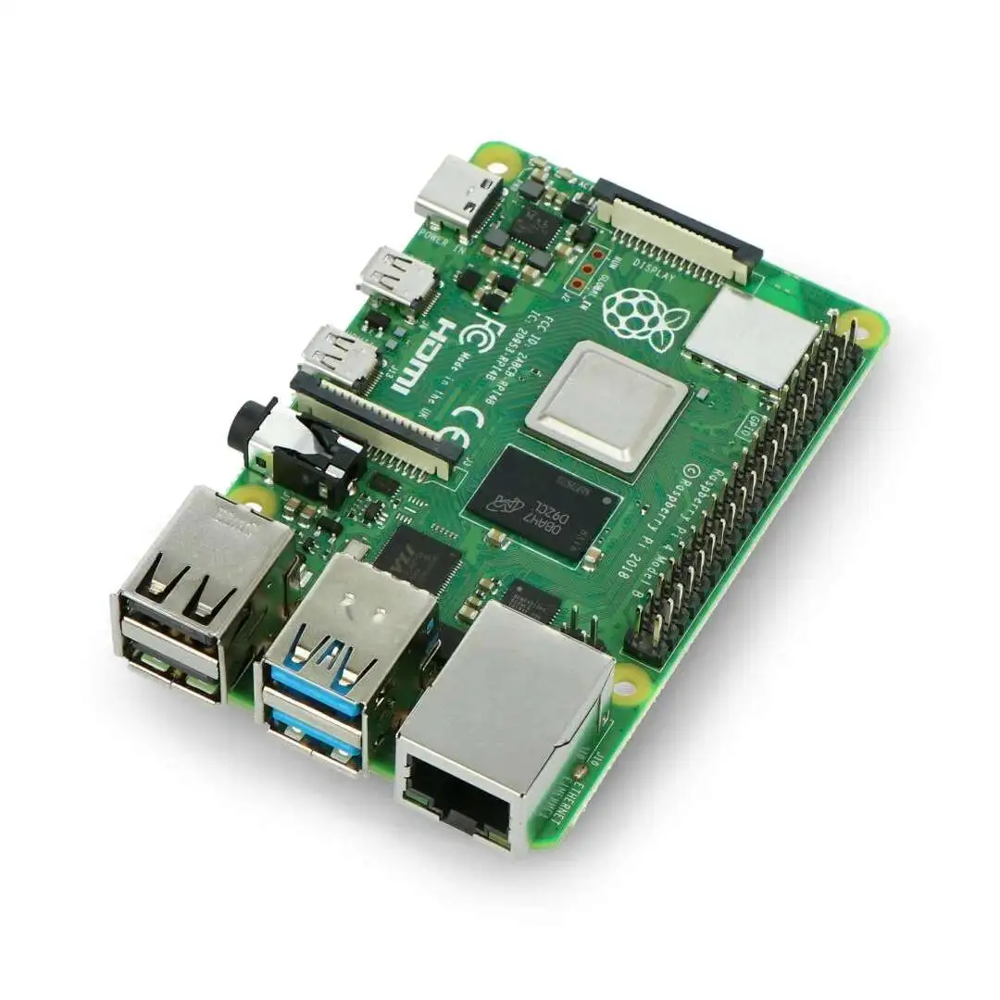
  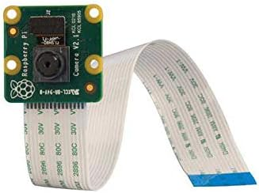
  
  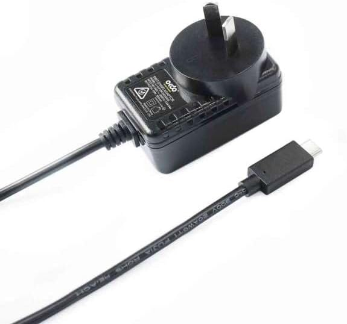
  
  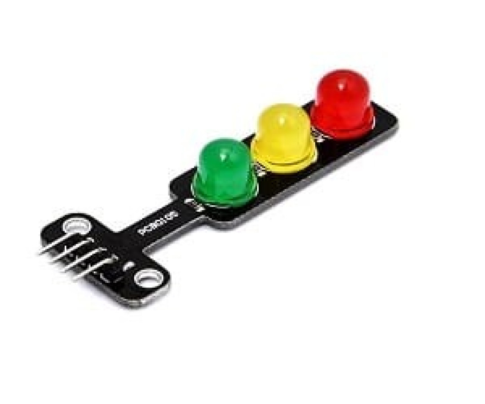
  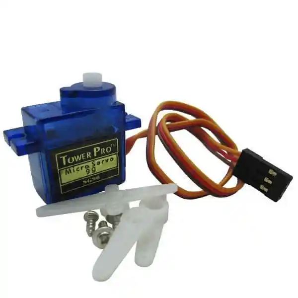
  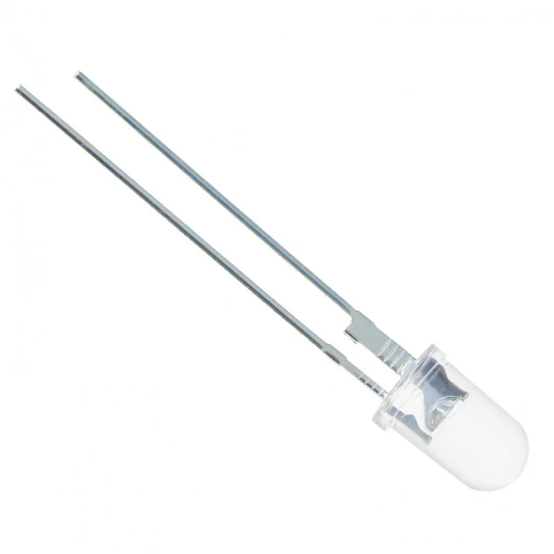
  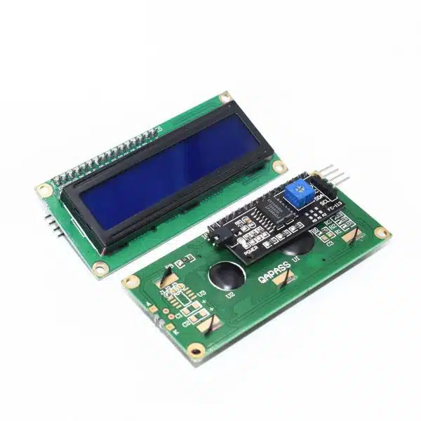
  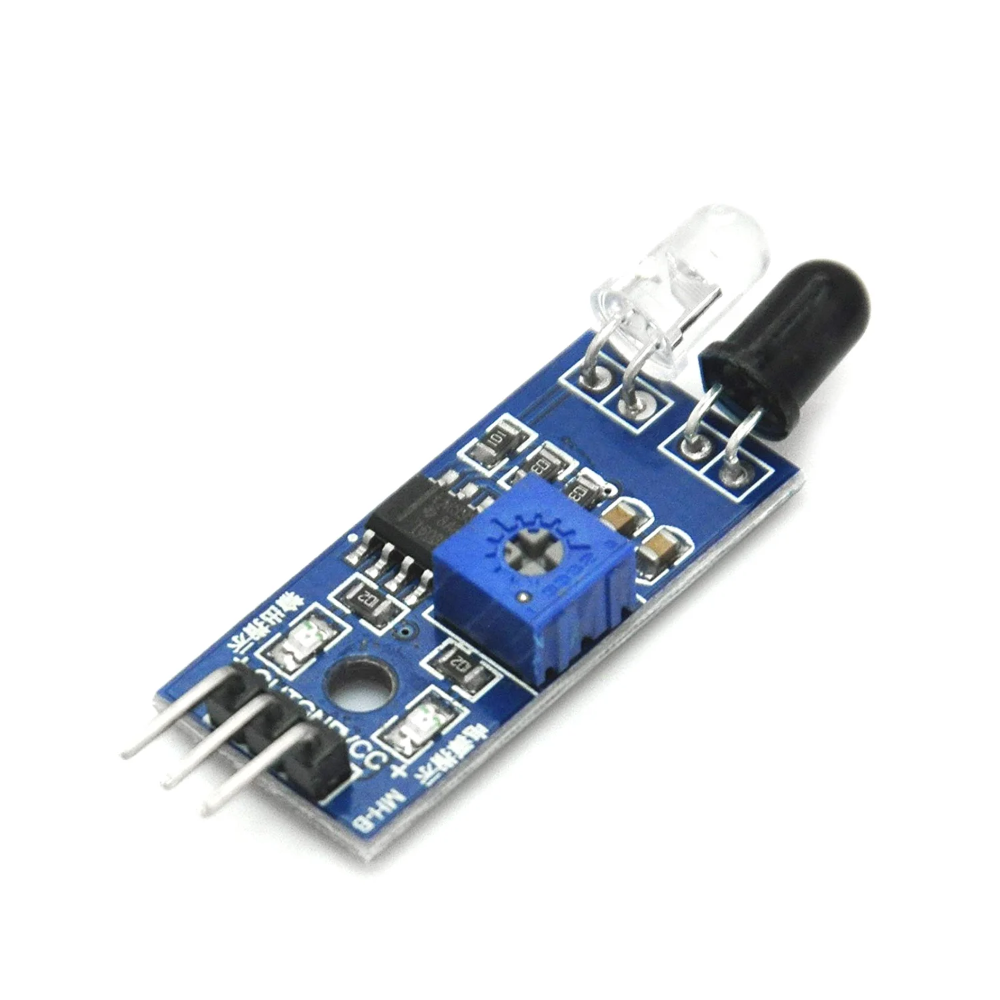
  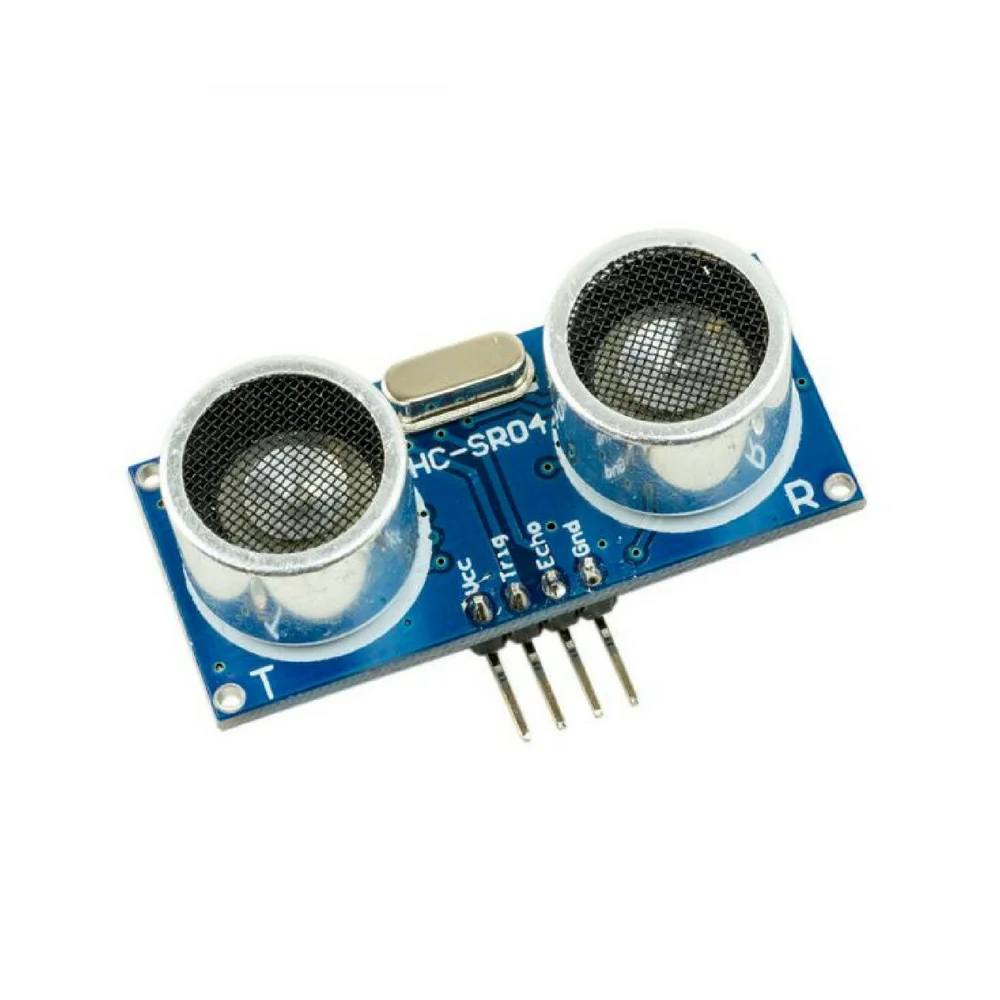
  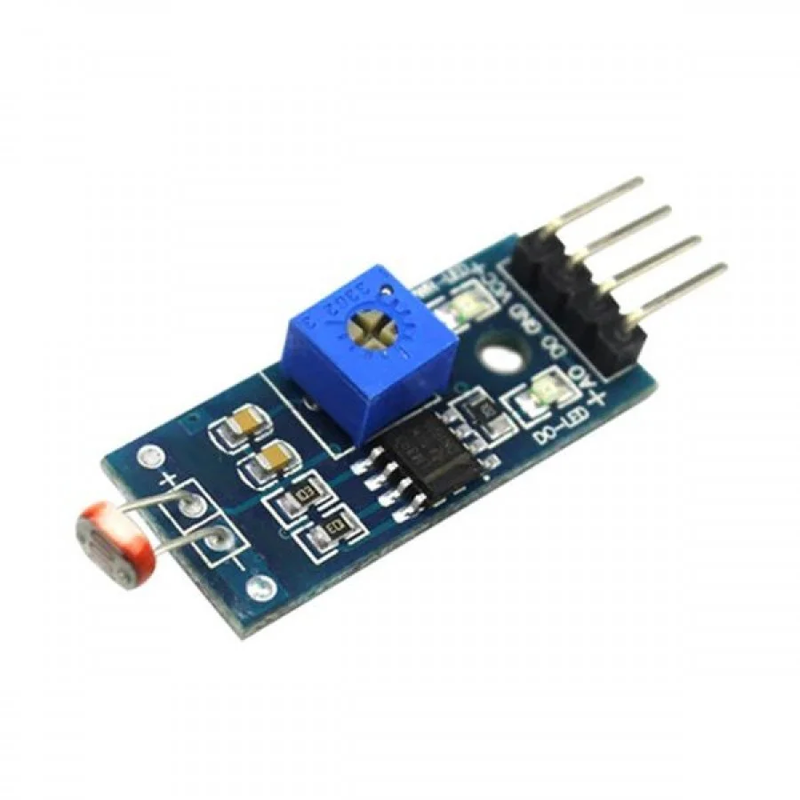
  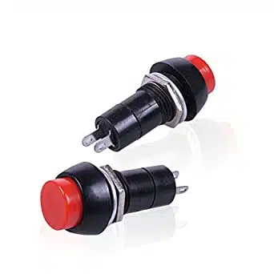

## Construction
- Starting to make the project, we used a cardboard and drew on it the road and focused on one side of the road, then we colored the drawing and the result as shown in the following images

  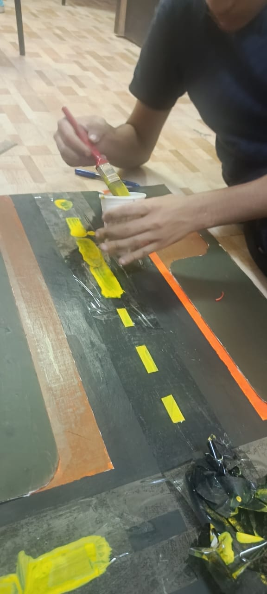

- Secondly, we printed a 3D part as the stand that will carry the traffic light and the camera module, as shown in the 3D folder and in the images following

  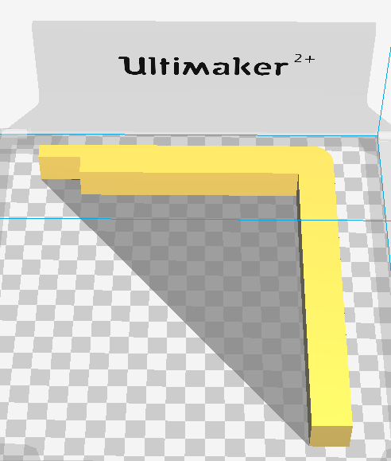
  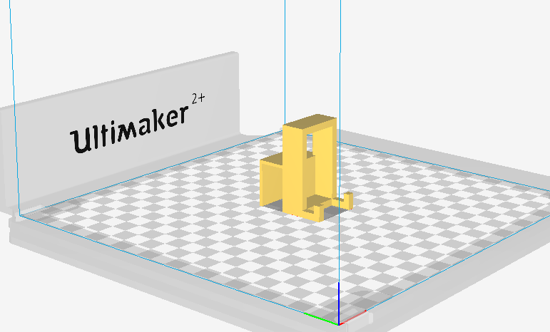
  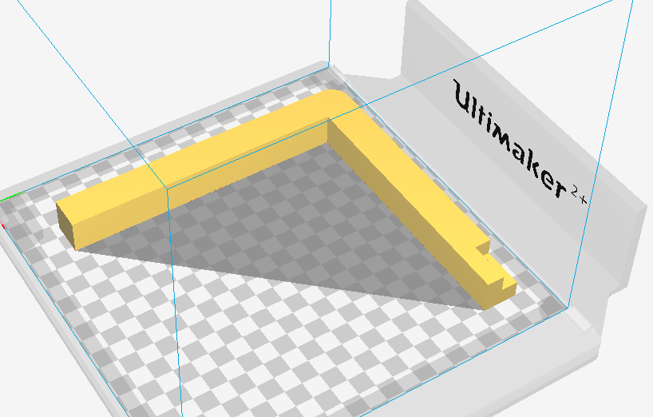

- Third, we start adding the component that we afford to get and make the connection beneath the road, and add some cups to carry it up upon the floor, then test the wired component in each system on its own, then test two systems, then check if all the systems are working together.

## AI
- First of all, I used the YOLO model directly without any training or making a specific model for my project, and it was good with actual images from real life, but for toy cars in the prototype, it always says mostly toy car without differentiation between the emergency and normal cars.
- Second, I used Edge Impulse as I saw a video on YouTube, so I tried to train a model using it, and the good thing is that it extracted as a library, so it can work offline so low latency, but I found a very low accuracy as it used a weak model for training.
- Third and will be used as it will be the most accurate way with RP which is using YOLO to train a specific model for my data and upload it to work on the RP local host and connected to the camera real-time sending the data real-time to the firebase and it will give higher accuracy as the YOLO is a heavy and strong model that I tested by the ESP32 CAM and it was accurate but the latency it very high it may take 20 minutes to change sence so we changed our mind to using RP as the main AI detection unit as it use local server that is not on a laptop or another device so it use network no as the camera is connected direct so it work face with very low latency also because its high processing unit it give higher frames with higher accuracy with a very low latency.

## How it works
- The Raspberry Pi sends the result through a real-time Firebase database, then the ESP32 receives it and processes it to choose if action needs to be taken, whether to change the traffic light time or to open the emergency gate, and the ESP32 processes other systems (light, push button, and speed bump)
- The app gets data from the Firebase to display real-time data

## coding
- Python for the AI model and the RP code
- C++ for the ESP32 CAM code
- Dart for Flutter app code

## cost
- As shown in [BOM.csv](https://github.com/Hasona57/Smart-Road/blob/79e5c046aa0be40c0b9f62295015dc0e1bf572b4/BOM.csv) approxmate price is 8835 EGP
- For me, I have some of the components as I have an LCD I2C, a Push button, an LDR, 3 servos, a traffic light, a breadboard, an ESP32, LEDs, a Relay, a 5V Adapter, some Resistance, and 2 IRs, so it will be ~7935.5 EGP (Egyptian Pounds)

## This project is for Hack Club Blueprint for more information [Hack-Club-Blueprint](https://blueprint.hackclub.com/)
