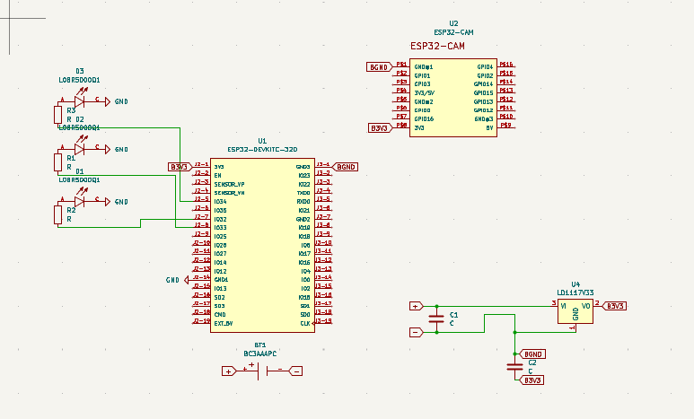
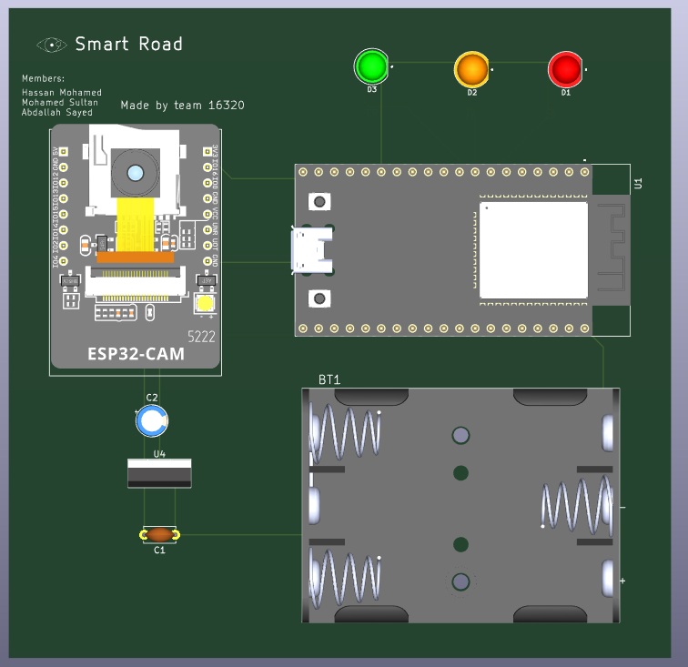

# Smart Road Eye: AI Traffic Management System

## Project Overview

The **Smart Road Eye** is a project that check the road by using an ESP32-CAM and send data to a firebase Realtime database. Another ESP32 is connected with traffic light and control them based on the data analysis by the ESP32-CAM AI. the firebase is connected with an app build with MIT App Inventor and it display the important details about the road at Realtime for drivers to check it also it send the percent of pollution to try another road if this one is highly polluted mean that there are a lot of cars.

### How It Works

1. **AI Vision Monitoring**: An ESP32-CAM module monitors the road with an AI based code that analysis the images and then it send to Firebase
2. **Data Collection**: Traffic density and pollution levels are collected and sent to Firebase Realtime Database
3. **Smart Control**: A master ESP32 controller retrieves data from Firebase and controls traffic lights
4. **Driver App**: An MIT App Inventor application displays real-time road status, allowing drivers to choose less congested or polluted routes

## Project Journey

### Ideation
The project began with the goal of reducing accidents and crowded roads. The core concept involves using AI vision to monitor roads, send commands to traffic actuators (motors/lights), and provide real-time app-based data for drivers.

### Hardware & PCB Design
- Custom PCB design using KiCad
- Research and implementation of correct component footprints
- Schematic design for controllers and sensors

### AI & Software Development
- Research and testing of Python libraries for image analysis
- Validation using online road images to ensure effectiveness

### PCB Refinement
- Added robust power system with BC3AAAPC battery holder
- Integrated LD1117V33 LDO for stable 3.3V power supply
- Implemented dedicated TX/RX serial link between ESP32 and ESP32-CAM

### Enclosure Design
- Custom 3D-printed case designed in Fusion 360
- Top and bottom parts with snap-fit assembly
- Openings for camera lens and ESP32 USB port for programming access

## Project Images

### Schematic Design
The schematic shows the complete circuit design including power management, communication links, and component interconnections.



### PCB Layout
The PCB layout demonstrates the physical arrangement of components, routing, and power planes optimized for the Smart Road Eye system.



### CAD Design
The 3D CAD models show the enclosure design with top and bottom parts designed for 3D printing.

**Top View:**


**Bottom View:**


## Key Features

- **AI Traffic Analysis**: ESP32-CAM analyzes road conditions to determine traffic density
- **Real-time Database**: Firebase Realtime Database stores and serves live data
- **Smart Traffic Control**: Master ESP32 controls traffic lights based on AI analysis
- **Driver-Facing App**: MIT App Inventor app displays real-time road status including pollution levels
- **Battery Powered**: Custom PCB designed to run entirely from a 3x AAA battery pack
- **Robust Power Design**: High-current LD1117V33 LDO supplies stable 3.3V power to both ESP32s

## Hardware Components (Bill of Materials)

| Component | KiCad Reference | Description |
|-----------|----------------|-------------|
| Main Controller | U1 | ESP32-DEVKIT-32D |
| Camera Module | U2 | ESP32-CAM |
| LDO Regulator | U4 | LD1117V33 (3.3V, 800mA+ LDO) |
| Battery Holder | BT1 | BC3AAAPC (3x AAA, Through-Hole) |
| Input Capacitor | C1 | 1µF (Ceramic, for LDO input) |
| Output Capacitor | C2 | 10µF (Electrolytic, for LDO output stability) |
| Status LEDs | D1, D2, D3 | LOBR5000Q1 (or any 3mm/5mm LED) |
| LED Resistors | R1, R2, R3 | 220R (220 Ohm Resistors) |

## PCB Circuit Connections

### Power System

1. The **BC3AAAPC holder** (3x AAA batteries) provides an input voltage of ~4.5V
2. This 4.5V is connected to the **VIN (Pin 3)** of the **LD1117V33 LDO**
3. The **GND (Pin 1)** of the LDO is connected to the main circuit ground (BGND)
4. The **VOUT (Pin 2)** of the LDO outputs a stable **3.3V**
5. This 3.3V line (B3V3) is connected to:
   - The **3V3 pin** of the **ESP32-DEVKIT (U1)**
   - The **3.3V pin** of the **ESP32-CAM (U2)**

### Data Communication (UART)

A dedicated serial link is established using **UART2** to avoid conflicts with the programming ports.

**Master (U1) & Slave (U2):**
- U1 GPIO 17 (TXD2) with U2 GPIO 13 (RXD2)

**Slave (U2) & Master (U1):**
- U1 GPIO 16 (RXD2) with U2 GPIO 12 (TXD2)

## Software Setup

### Prerequisites

- Arduino IDE with ESP32 board support
- Firebase account and project setup
- MIT App Inventor account (for mobile app)

## Installation

1. Clone the repository:
   ```bash
   git clone https://github.com/Hasona57/Smart-Road.git
   cd Smart-Road
   ```

2. Install required Arduino libraries:
   - Firebase ESP32 Client
   - ESP32 Camera libraries

3. Configure Firebase:
   - Create a Firebase project
   - Add your Firebase credentials to the code
   - Set up Realtime Database rules


## Usage

1. Power on the system using the 3x AAA battery pack
2. The ESP32-CAM will start monitoring the road
3. Traffic data will be sent to Firebase
4. The master ESP32 will retrieve data and control traffic lights
5. Users can check road conditions via the MIT App Inventor app

## Mobile App

The MIT App Inventor application provides:
- Real-time traffic density information
- Pollution level monitoring
- Route recommendations based on current conditions

## Safety & Power Considerations

- The LD1117V33 LDO prevents overvoltage to the ESP32 modules
- Battery-powered design ensures operation during power outages
- Proper capacitor values ensure stable power delivery

## Contributing

Contributions are welcome! Please feel free to submit a Pull Request.

## License

This project is open source and available under the [MIT License](LICENSE).

## Author

**Hasona57**

- GitHub: [@Hasona57](https://github.com/Hasona57)

## Acknowledgments

- ESP32 community for hardware support
- Firebase for real-time database services
- MIT App Inventor for mobile app development platform

---
